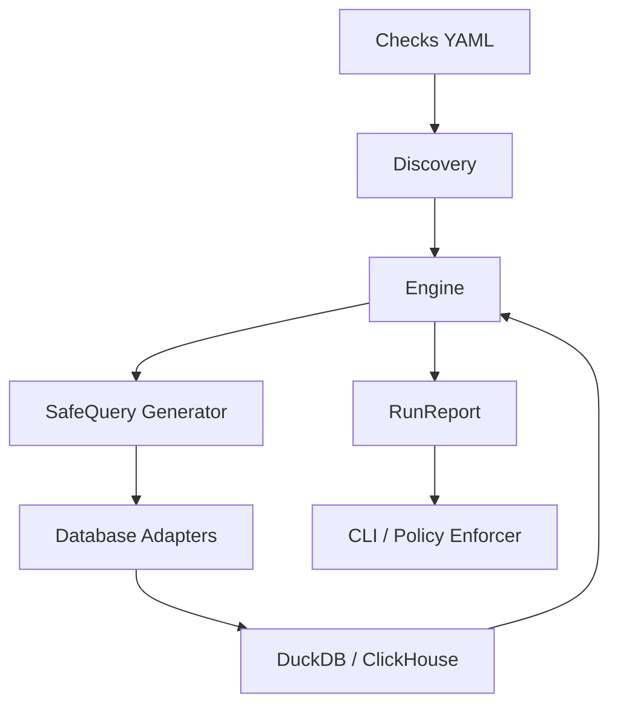

# TenantGuard DQ

An extensible, config-driven data quality engine for a multi-tenant wealth-management platform. It evaluates data against YAML-declared checks and automatically guards against duplicate keys, cross-tenant data leaks, and invalid constraints.

## Architecture



## Quickstart

```bash
pip install -e .
python fixtures\generate_data.py --mode clean`npython fixtures\generate_data.py --mode corrupt
dq demo --backend duckdb
```

## Project Tree
- `dq/`: The core engine
- `fixtures/`: Test data generators
- `checks/`: Declarations
- `docs/`: Documentation
